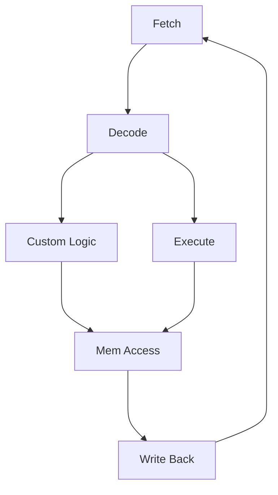

# Hardware Acceleration
A Hardware Accelerator is **NOT** a coprocessor - it is a unit that will receive info from the processor or other system component and do stuff to it and sped up through HWAccel

Hardware Acceleration is in the NIOS II System but not the processor itself - somewhere on the interface.
Not on CPU as CPU is offloading tasks

Why use one?
- Cost - overall system requirements may require a high cost (faster) CPU
	- there may be only one or two functions that place the demand for this performance
	- HW Acceleration may allow a cheaper slower CPU to be sufficient
- Performance
	- There are applications with real time demands and computational loads that no existing CPU can meet performance demands

TLDR; ITS A LOT OF EXTRA WORK - but its a lot faster
Question of when to use relies on how frequently task goes through HW Accelerator
Single Threaded - CPU can only do one task a time
	Count execution time of all processes
Multi Threaded - CPU can work on multiple tasks a time
	Find longest path through execution
$$
\begin{aligned}
\text{n = number of times executed}\\
\text{t = time} \\
Speed Up = n(t_{cpu}-t_{accel}) \\
\end{aligned}
$$
# NIOS II Custom Instructions
Allows time-critical software to be moved to hardware
- Essentially at the execute stage

Replace complex instructions with a single instruction. Used in C Code

Custom Instruction sits in the processor - in parallel with the execute stage

## Different Types
**Combinatorial** - Instruction completes in a single clock, only required port is the result port. Simple Tasks like bit/byte swapping
**Multi Cycle** - Requires two or more clocks to complete. Clk, Clk_en, reset ports required.
**Extended Custom** - Instructions that implement several different operations (group things together). Up to 256 operations. Similarly related instructions, but can be chosen on the fly based on a port
*Tangent - reg file is a file that holds all the registers used that are ported to the appropriate registers in the system.*
**Internal Register** - 