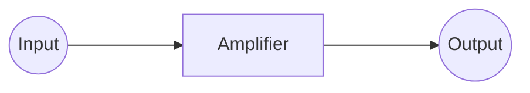
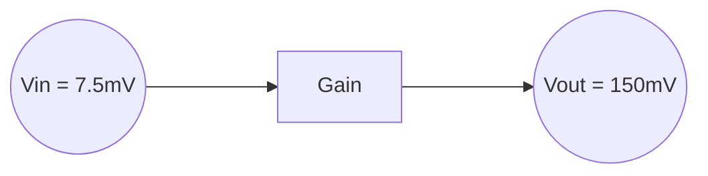
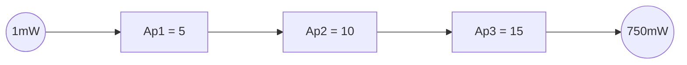

# Gain, Decibels, and Loss
---
Decibels in Communications
A wide range of signal levels are found in communications systems
Example : Two-Way radio
- Transmitter output power - 100 Watts ($10^2$)
- receiver input levels -- femtowatts

Easier to compare values in the form of logarithm of the ratio of values
	This is decibel notations
	Named for Alexander Graham Bell

Used for comparisons of
- Power, voltage, current, sound level
- Can represent system gains and losses
- Can represent absolute levels of power voltages or current

Example
![[Range_Example.png]]

The decibel is expressed as the logarithm of the ratio of two power levels
- The logarithm is the base not the natural log
$$
P_{dB} = 10 \times log_{10} (\frac{P_1}{P_2})
$$
Voltage and current will use 20 instead of 10.
$$
V_{dB} = 20 \times log_{10}(\frac{V_1}{V_2})
$$
$$
I_{dB} = 20 \times log_{10}(\frac{I_1}{I_2})
$$

**Attenuation** If the output power is greater than the input power then the numerical gain is > 1
**Loss** If the output power is less than the input power then the numerical gain is < 1

$$
A_v = \frac{V_{out}}{V_{in}} = \frac{150mV}{7.5mV}=20
$$

$$
A_{p_{total}} = A_{p1} + A_{p2} + A_{p3} + etc...
$$

Convert the gain in dB to a numerical value then multiply the input by the numerical gain
Example...
$V_{in} = 20mV$ 
$V_{out} = ?$
$A_v = 6dB$
$$
A_{v_{num}} = 10^{\frac{A_{v_{dB}}}{20}}
$$
$$
V_{out} = A_{v_{num}} \times 20mV 
$$

Example problem![[Pasted image 20250903113020.png]]
$$
4mW \times 2 \times 24 \times 7 = P_{out} = 
$$