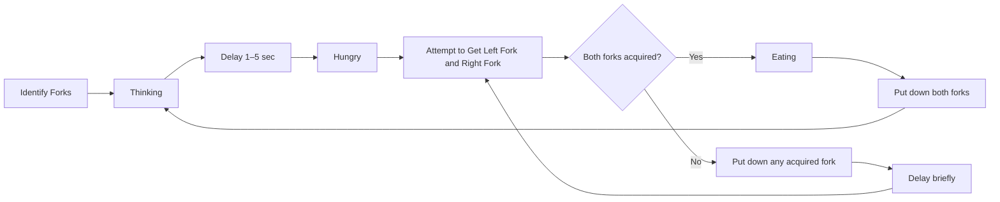

![[Pasted image 20260213122238.png]]

# Print Module
"Provides a module (.h and .c files) which protects access to the UART with a binary
semaphore and allows text strings to be printed to the UART through a module-defined
function"

Print Module will hold a ``Print_Line()`` function that will transmit to the UART after acquiring the semaphore.
Will also need an Init to create the semaphore before ``Print_Line()`` is called.
```C
void Print_Init(void)
{
	uartPrintSem = newSema(args);
}

void Print_Line(const char *fmt, ...)
{
	char buffer[256];
	
	/*
	arb argument stuff so I can pass %d, %i blah
	*/
	
	Down(); 
	HAL_UART_Transmit(/*line*/);
	UP();
}
```

# Philosophers
The meat
We have ONE Philosopher task, that gets created ``NumPHIL`` times, in this case 8. We will also have a fork Semaphore array of size 8. Each fork will be it's own semaphore.

Each philosopher will identify which forks they want, then begin the state machine.

We will create an array of philosophers and pass that array as an argument to the new task.
```C
	for(int i = 0; i < 8; i++){
		PhilosopherNum[i] = i;
		osThreadNew(PhilosopherTask, &PhilosopherNum[i], &philAttr); // by passing &PhilosopherNum[i] we can access the array number of the philosopher in the philosopher task
	}
```

Array number as ID in philosopher task
```C
void PhilosopherTask(void *argument){
	int id = *(int*)argument; // this takes the value of &PhilosopherNum[i] that we passed to the new thread
}
```

The state machine will look something like this
```C
while(1){
	//Thinking
	Print_Line("Thinking");
	
	//delay
	osDelay(/*random numer*/);
	
	// Hungry
	Print_line("Hungry");
	while(/*doesn't have both forks*/){
		
		getRight()
		getLeft()
		
		if(/*Got left and not right*/) {
			/*put left down and set bool false*/
		}
		if(/*Got right and not left*/) {
			/*put right down and set bool false*/
		}
		
		osDelay(10);
	}
	
	// Eating
	Print_Line("Eating");
	//delay
	osDelay(/*random numer*/);
	
	putForkLeft();
	putForkRight();
}
```

Fork functions
```C
static bool GetLeftFork(int leftForkIndex){
return(osSemaphoreAcquire(forkSemaphoreHandle[leftForkIndex], 0) == osOK);
}

static bool GetRightFork(int rightForkIndex){
return(osSemaphoreAcquire(forkSemaphoreHandle[rightForkIndex], 0) == osOK);
}

static void putLeftFork(int leftForkIndex){
osSemaphoreRelease(forkSemaphoreHandle[leftForkIndex]);
}

static void putRightFork(int rightForkIndex){
osSemaphoreRelease(forkSemaphoreHandle[rightForkIndex]);
}
```


Some things I noticed post lab
1. Randomize which fork is attempted to be picked up first.
   ```C
int randFork = rand() & 1; // 0 or 1
if (randFork == 0) {
gotLeft = GetLeftFork(desiredLeftFork);
gotRight = GetRightFork(desiredRightFork);
}
else {
gotRight = GetRightFork(desiredRightFork);
gotLeft = GetLeftFork(desiredLeftFork);
}
   ```
   2. Seed the randomizer for each philosopher
**When the randomizer is not seeded per philosopher - they will all have the same delay, and a pattern of who eats will occur**
We can do this by giving the seed the id of the philosopher
```C
void PhilosopherTask(void *argument){
	srand(id);
	/*
	do stuff
	*/
}
```
