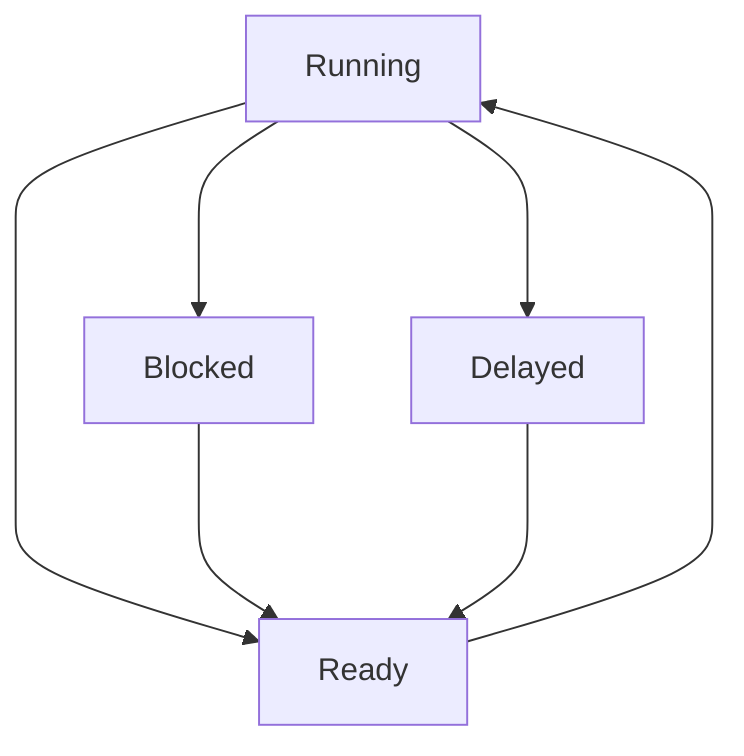
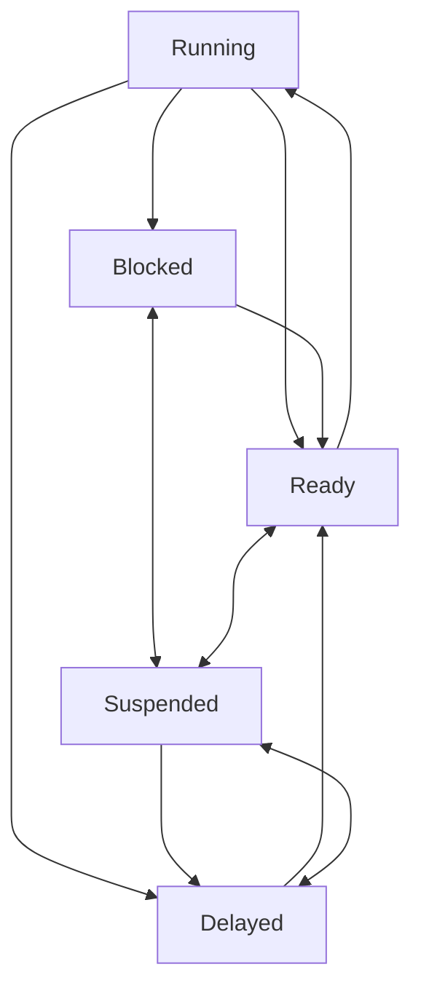

## Task States

1. Running -> Ready
	1. **Running state can only have one task per CPU**
	2. Preempted by scheduler
	3. Wait on signaled resource
	4. signal a resource
	5. Call osThreadYield()
2. Ready -> Running
	1. Selected by schedule
	2. **There always has to be something running on the CPU**
		1. There is such a thing as a *null* task that runs when nothing else is happening -- typically nothing can be written for the null task, but some OS's allow it
3. Running -> Blocked
	1. Wait on unsigned resource
	2. Something the task wants is not present
	3. Blocked task does not automatically become the next task in queue
4. Running -> Delayed
	1. Call osDelay()
	2. Call osDelayUntil()
5. Blocked -> Ready
	1. Resource is signaled
6. Delayed -> Ready
	1. Time Delay Expires
						 **THE FOLLOW STATES ARE BAD DESIGN**
7. Delayed <-> Suspended
	1. osKernelSuspend() is called
	2. osKernelResume() is called
8. Blocked <-> Suspended
	1. osKernelSuspend() is called
	2. osKernelResume() is called
9. Ready <-> Suspended
	1. osKernelSuspend() is called
	2. osKernelResume() is called

An RTOS is always switching between tasks, so an RTOS cannot be idle. It must have a task to switch tasks (null task -> queued task)

Scheduler can pick **ANY** task that it wants to perform next, it is undefined. 
This is the ***Scheduling Policy***

Tasks never terminate *generally* - a task can terminate, but it's not common
When a task is giving something, it is signaling a resource.
When a task is delayed, it is waiting for a resource
Task is to start application process, then terminate that task. Use that task to start *YOUR* stuff, then terminate the default task

**Deadlock** - waiting for tasks that will **NEVER** happen

## FreeRTOS and ST-Micro Tools
### RTOS Initialization
```C
/* Init scheduler */
osKernelInitialize();

//...Create at least one task...

/* Start Scheduler */
osKernelStart();
/* We should never get here as control is now taken by the scheduler */
```
The RTOS requires a periodic timer, which is selected as TIM1 in CubeMX

When other RTOS resources are used, additional init function calls are needed

Necessary to create at least one task, as the scheduler will look through ready tasks and start one. If nothing is ready the RTOS will not run and crash

Before scheduler starts, everything is put in ready state
**EVERY TASK IS CREATED READY TO RUN**

Once Scheduler is started, only tasks will execute
- We can create tasks from within a task, but if we don't create a task before the scheduler is started none can ever be created

Program will never end, all tasks should be infinite loops. With the exception of default task should terminate itself

**Suggestion** - try to modify ST Micro code as LITTLE as possible. Create our own files, our own code, etc... Create a C and header file for each task that you write, then you only need to modify the default main function to start up all your tasks. 
- We aren't using object oriented, but we can style it as such

```C
void StartDefaultTask(void *argument)
{
	/*USER CODE BEGIN 5*/
	/*Infinite Loop*/
	for (;;;)
	{
		//...Task Body
	}
	/*USER CODE END 5*/
}
```
---
Remove For loop
```C
void StartDefaultTask(void *argument)
{
	/*USER CODE BEGIN 5*/
	
	//create your own tasks
	//create a function that ends this task
	
	/*USER CODE END 5*/
}
```
**TASK FUNCTIONS ARE NOT ALLOWED TO REACH THEIR ENDING, USE A FUNCTION TO TERMINATE THE TASKS - A TASK CAN ONLY TERMINATE ITSELF**

Generally speaking there won't be any arguments. Tasks will usually use global variables
Most OS's don't allow passing arguments to tasks

```C
/*Creation of defaultTask*/
defaultTaskHandle = osThreadNew(StartDefaultTask, NULL, &defaultTask_attributes);
```


```C
/* Definitions for defaultTask*/
osThreadId_t defaultTaskHandle;
const osThreadAttr_t defaultTask_attributes = {
	.name = "defaultTask",
	.stack_size = 128 * 4,
	.priority = (osPriority_t) osNormalPriority
};
```

NP Complete - You dont stand a chance at figuring it out

### Visualizing Tasks
Each task is represented by a parallelogram 
Interactions between tasks are represented by arrows which connect "sockets"
- Connections to hardware are simple arrows without sockets
- Complex diagrams, where tasks interact, the socket characteristics become critical to the design and to understanding the task interaction

