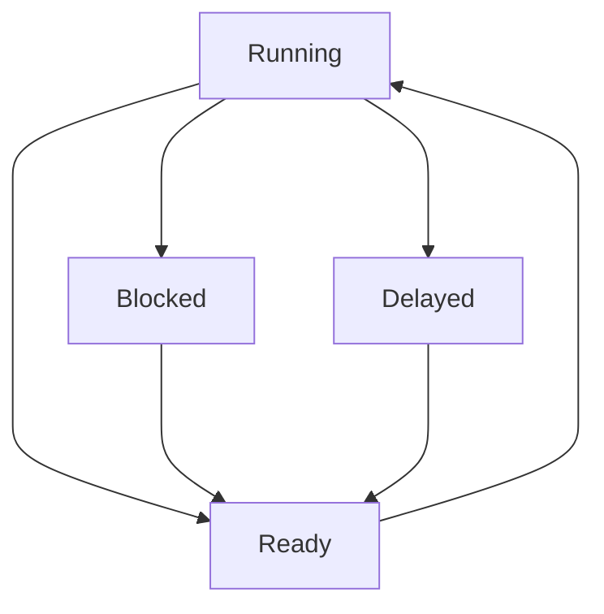

## Task States

1. Running -> Ready
	1. **Running state can only have one task per CPU**
	2. Preempted by scheduler
	3. Wait on signaled resource
	4. signal a resource
	5. Call osThreadYield()
2. Ready -> Running
	1. Selected by schedule
	2. **There always has to be something running on the CPU**
		1. There is such a thing as a *null* task that runs when nothing else is happening -- typically nothing can be written for the null task, but some OS's allow it
3. Running -> Blocked
	1. Wait on unsigned resource
	2. Something the task wants is not present
	3. Blocked task does not automatically become the next task in queue
4. Running -> Delayed
	1. Call osDelay()
	2. Call osDelayUntil()
5. Blocked -> Ready
	1. Resource is signaled
6. Delayed -> Ready
	1. Time Delay Expires

An RTOS is always switching between tasks, so an RTOS cannot be idle. It must have a task to switch tasks (null task -> queued task)

Scheduler can pick **ANY** task that it wants to perform next, it is undefined. 
This is the ***Scheduling Policy***
